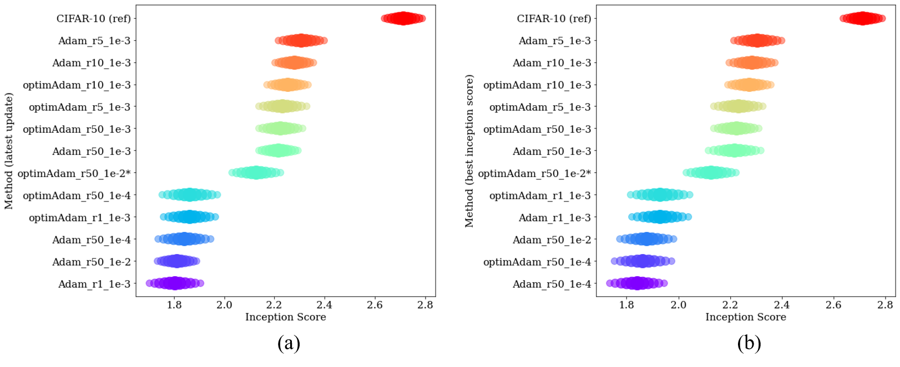

# torch_optGAN

This is the pytorch implementation of [Training GANs with Optimism](https://arxiv.org/abs/1711.00141) for the NYCU Optimization Algorithms lecture (111 Autumn).

Author: [Philips Lai](https://github.com/cemeteryparty) and [tim-pan](https://github.com/tim-pan)

## Installation

```shell
pip install torch==1.12.1+cu113 torchvision==0.13.1+cu113 torchaudio===0.12.1+cu113 -f https://download.pytorch.org/whl/cu113/torch_stable.html
conda install pytorch==1.12.1 torchvision==0.13.1 torchaudio==0.12.1 cudatoolkit=11.3 -c pytorch
pip install matplotlib
pip install torchinfo
pip install scipy
```

## Result



## Reference

https://github.com/vsyrgkanis/optimistic_GAN_training
https://github.com/Zeleni9/pytorch-wgan
